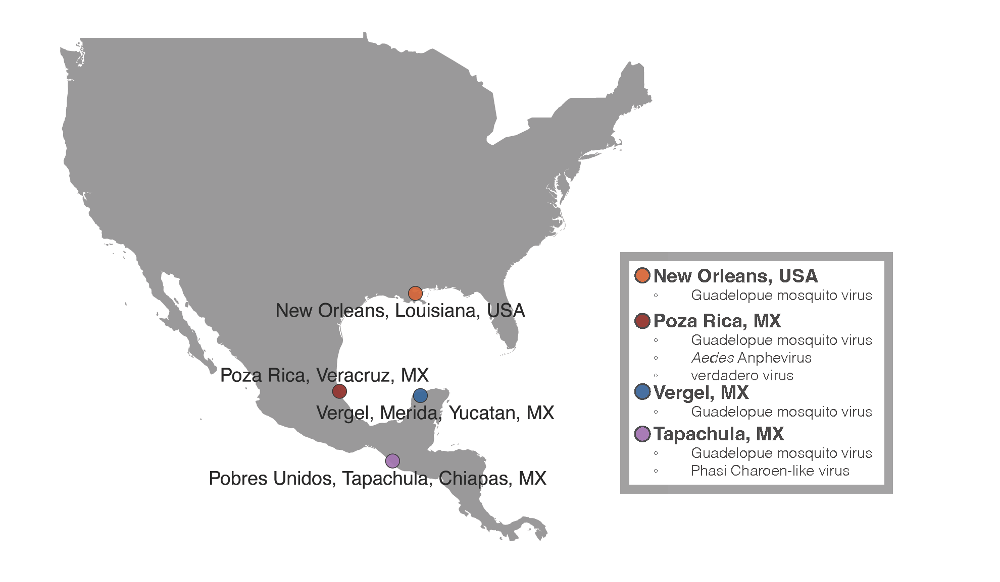
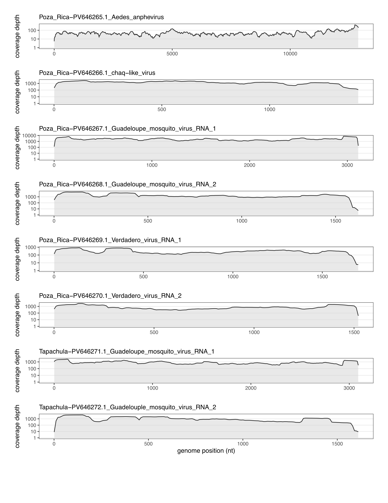
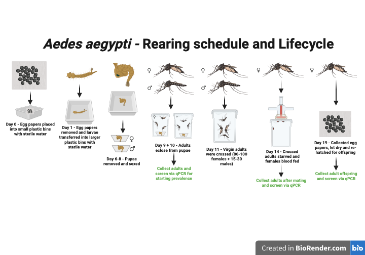
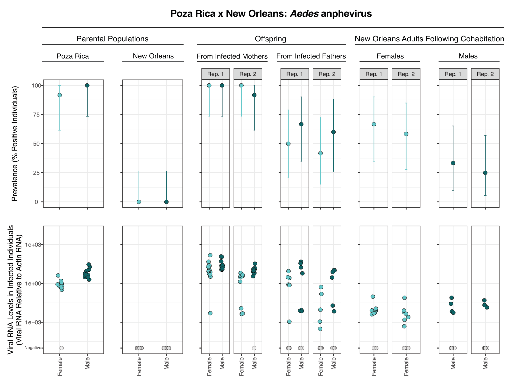
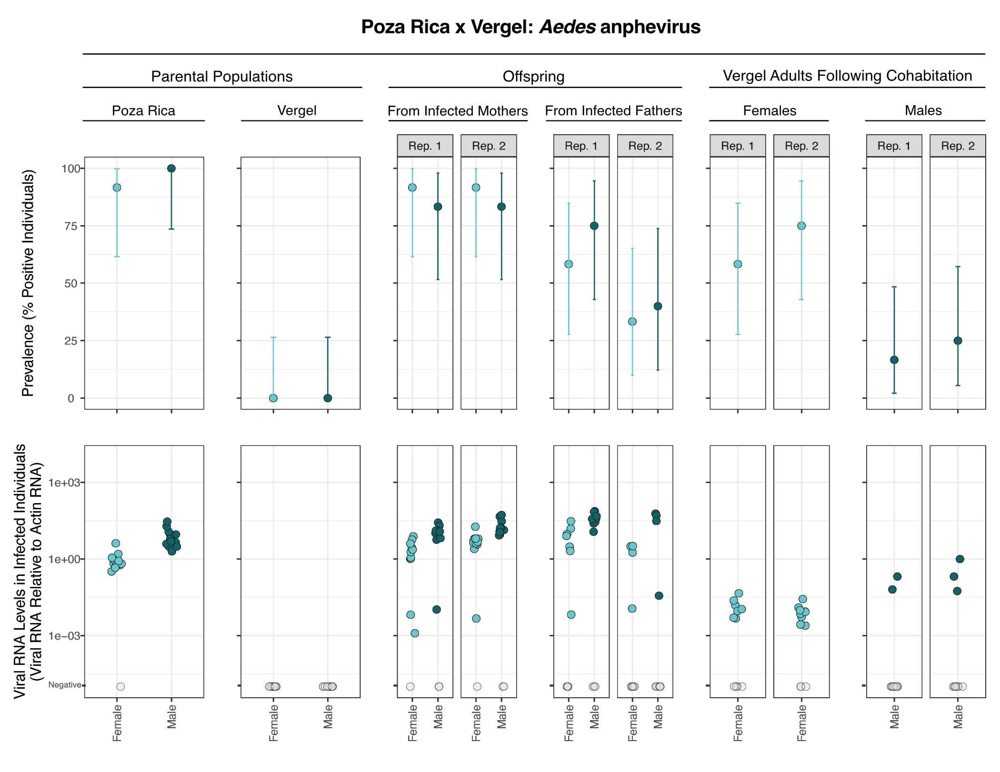
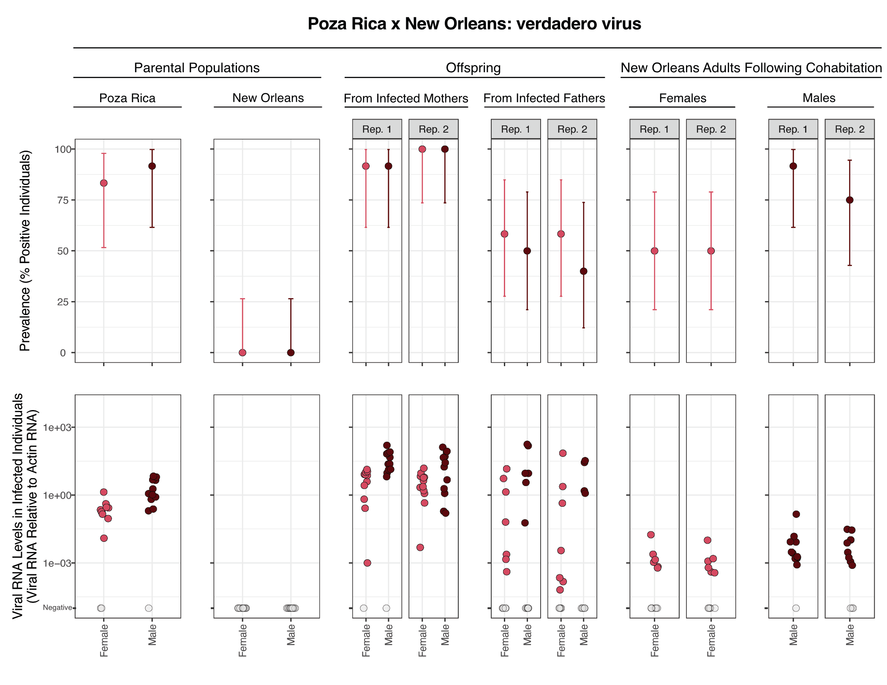
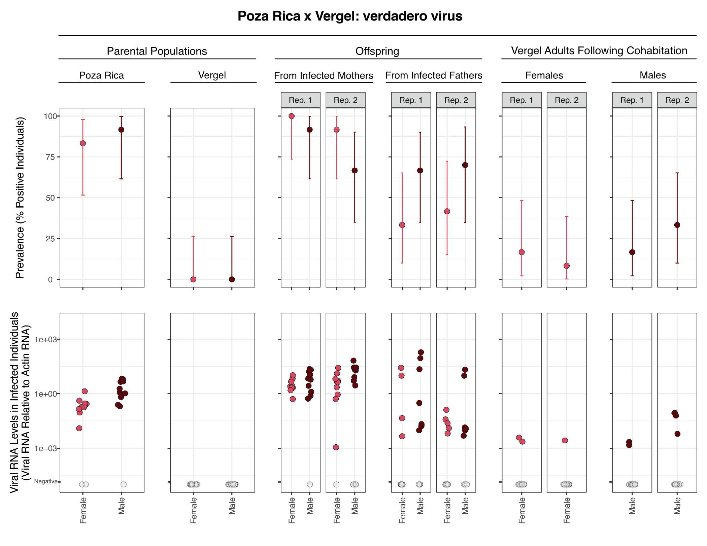
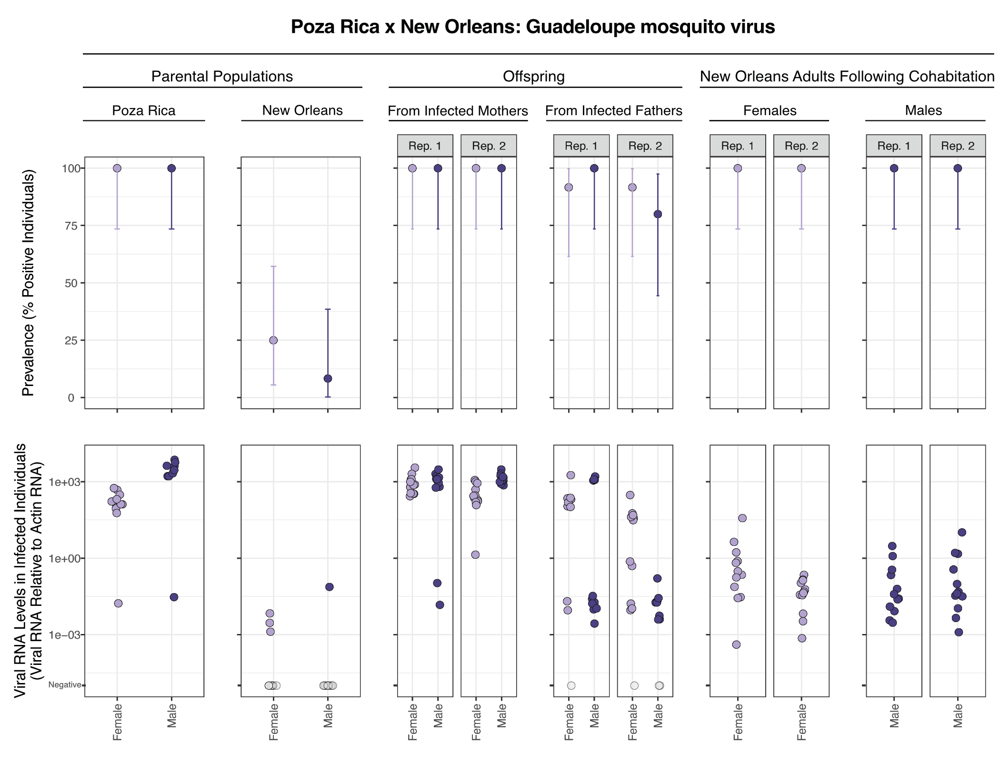
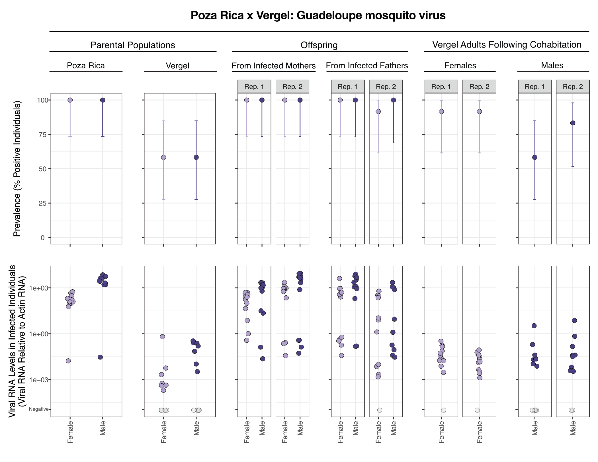
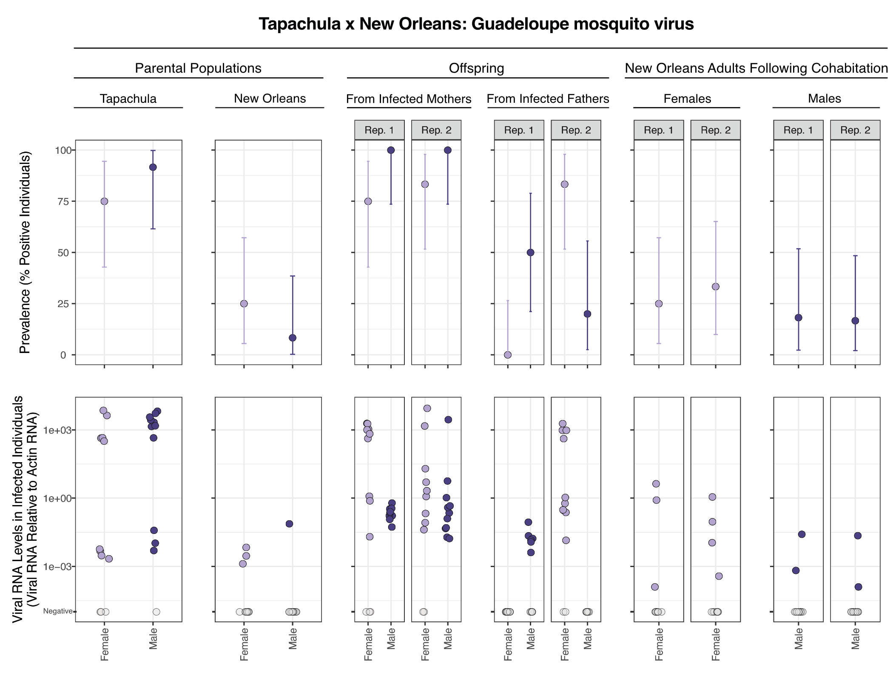

---
format:
  html: default
  docx: 
    reference-doc: custom-reference-doc.docx

bibliography: references.bib
csl: asm.csl #Get themes at https://github.com/citation-style-language/styles
crossref:
  custom:
    - kind: float
      key: suppfig
      latex-env: suppfig
      reference-prefix: Supplemental Figure
      space-before-numbering: true
      latex-list-of-description: Supplementary Figure
    - kind: float
      key: supptab
      latex-env: supptab
      reference-prefix: Supplemental Table
      space-before-numbering: true
      latex-list-of-description: Supplementary Table
    - kind: float
      key: box
      latex-env: box
      reference-prefix: Box
      space-before-numbering: true
      latex-list-of-description: Box
---

```{r knitr_settings, eval=TRUE, echo=FALSE, cache=FALSE}
suppressPackageStartupMessages(library(tidyverse))
suppressPackageStartupMessages(library(knitr))
suppressPackageStartupMessages(library(readxl))

options(tidyverse.quiet = TRUE)

opts_chunk$set("tidy" = TRUE)
opts_chunk$set("echo" = FALSE)
opts_chunk$set("eval" = TRUE)
opts_chunk$set("warning" = FALSE)
opts_chunk$set("message" = FALSE)
opts_chunk$set("cache" = FALSE)

inline_hook <- function(x, digits=2){

  if(is.list(x)){
    x <- unlist(x)
  }
  if(is.numeric(x)){
      sprintf(paste0("%0.", digits, "f"), x)
  } else {
      paste(x)
  }
}
knitr::knit_hooks$set(inline=inline_hook)

# creates markdown-formatted scientific notation text output
sci_notation <- function(value, digits = 1) {
  # start with sprintf scientific notation
  t <- sprintf(paste0("%0.", digits, "e"), value)
  # replace zero padding in exponent
  t <- str_replace(t, "e0", "e")
  t <- str_replace(t, "e-0", "e-")
  t <- str_replace(t, "e\\+0", "e")
  # switch to markdown superscript
  t <- str_replace(t, "e", "×10^")
  t <- str_replace(t, "$", "^")
  t
}

```

# Biparental vertical transmission of *Aedes* anphevirus, Guadeloupe mosquito virus, and verdadero virus in colonized *Aedes aegypti*

<br>

Tillie J. Dunham^1^, Karla Saavedra‐Rodriguez^1^, Brian D. Foy^1^, Christie E. Mayo^1^, and Mark D. Stenglein^1^*

<br>

*: Correspondence: Mark.Stenglein@colostate.edu

<br>

1. Center for Vector-Borne Infectious Diseases, Department of Microbiology, Immunology, and Pathology, College of Veterinary Medicine and Biomedical Sciences, Colorado State University, Fort Collins, CO, 80523, USA



## Abstract

*Aedes aegypti* are a major vector of arboviruses, which infect these mosquitoes and can be transmitted to, and cause disease in, vertebrates. *Ae. aegypti* can also be infected by insect-specific viruses, which do not infect vertebrates, but may impact mosquito biology and vector competence. In this study we characterized the viromes of *Ae. aegypti* populations that had been maintained in laboratory colonies for 4 to 18 years. Mosquitoes were originally from Tapachula, Poza Rica and Merida, Mexico and New Orleans, USA. We used metagenomics to characterize the viruses present in the colonies, then quantified the vertical transmission efficiencies of the viruses by performing controlled crosses between populations. The viruses infecting these colonies included *Aedes* anphevirus, Guadeloupe mosquito virus, and verdadero virus. These viruses were at high prevalence in infected populations, with over 75% of individual adult mosquitoes infected. All three viruses exhibited biparental vertical transmission: both infected mothers and infected fathers transmitted infection to their offspring, but in all cases maternal transmission was more efficient than paternal. We also identified evidence of possible horizontal transmission between adult mosquitoes that had cohabitated during crosses. Efficient transgenerational transmission likely contributes to the ability of these viruses to persist in laboratory populations and nature. Because of their efficient vertical transmission and minimal apparent fitness costs, these viruses could be good candidates for gene delivery to mosquito populations, including for vector control.




## Introduction

*Aedes aegypti* mosquitoes transmit important arbovirus pathogens including dengue, Zika, and chikungunya viruses [@Souza_Neto_2019]. Although the global burden of arboviral disease is high, individual mosquitoes are only rarely infected by arboviruses [@Mgongoma_2026]. In contrast, mosquitoes are commonly infected by so-called insect-specific viruses (ISVs) [@Blitvich_2015; @Bolling_2015; @Vasilakis_2015; @Agboli_2019; @Moonen_2023; @Wilkman_2025]. ISVs have no apparent ability to infect vertebrates and few well characterized fitness impacts on their mosquito hosts. A growing number of studies have characterized the virome of wild mosquitoes [@Stollar_1975; @Ng_2011; @Fauver_2016; @Shi_2016; @Calisher_2018; @Sadeghi_2018; @Zakrzewski_2018; @Shi_2019; @Batson_2021; @de_Almeida_2021; @Koh_2024]. Mosquito-infecting ISVs are diverse in terms of their prevalence and genetics, with representatives from all major groups of viruses. 

ISVs are relevant to vector-borne diseases because they could naturally alter vector competence or could be used to deliver genes to mosquito populations [@Carlson_2006; @Ren_2008; @Bolling_2015; @Vasilakis_2015; @Johnson_2018]. There is experimental and observational evidence that ISVs can interfere with arbovirus replication in cultured cells or reduce vector competence [@Bolling_2012; @Kenney_2014; @Goenaga_2015; @Romo_2018; @Schultz_2018; @Baidaliuk_2019; @McLean_2021; @Shi_2022; @Olmo_2023]. Nevertheless, arboviruses remain a substantial public health problem despite the ubiquity of ISVs, and the impact of ISVs on vector competence is likely a function of complex environmental and genetic variables. It is possible that ISVs could be genetically engineered to block arbovirus replication beyond their natural ability to do so [@Carlson_2006; @Ren_2008]. Alternatively, ISVs, especially common ones, could provide a means to study mosquito population structure and ecology [@Hollingsworth_2023]. 

The virome of lab-colonized mosquitoes is less diverse than that of their wild counterparts [@Zakrzewski_2018; @Parry_2018; @Shi_2020; @Coatsworth_2022]. Certain ISVs tend to predominate in mosquito colonies [@Shi_2020; @Coatsworth_2022]. These viruses presumably have properties that enable them to persist in laboratory populations, including efficient transmission and minimal fitness costs. 

Here, we used metagenomic sequencing to characterize the virome of four colonies of *Ae. aegypti* maintained in our insectary. We performed experimental crosses to investigate transmission from infected mothers or fathers to offspring and evaluated evidence of possible horizontal transmission. Inclusion of distinct outbred populations in experiments enabled us to assess whether transmission efficiency might vary as a function of mosquito genotype.



## Materials and Methods

**Mosquito colonies:** All colonies were maintained in the insectary of the Center for Vector-Borne Infectious Diseases at Colorado State University in Fort Collins, Colorado, USA. Poza Rica *Ae. aegypti* were originally collected from Poza Rica, Veracruz, Mexico in 2012 [@Vera_Maloof_2015] (**[@suppfig-map]**). Tapachula *Ae. aegypti* were originally collected from Tapachula, Chiapas, Mexico in 2018 [@Solis_Santoyo_2021]. New Orleans *Ae. aegypti* were originally collected in New Orleans, Louisiana, USA in 2005 [@Vera_Maloof_2020]. Vergel *Ae. aegypti* were originally collected in Mérida, Yucatán, Mexico in 2011 [@Kubik_2021]. Experiments were performed in June 2022.

**Mosquito rearing:** At all life stages, mosquitoes were housed at 27˚C and 75-80% humidity. Eggs were hatched in 5x12 inch plastic bins with 800 mL of autoclaved room temperature deionized water (DI H2O). Growth containers were covered with organdy fabric secured by rubber bands. Egg papers were removed 24 hours after hatching and larvae were moved into 16x32 inch plastic containers with 2 inches of tap water. Aquatic stages were provided with 1/4 teaspoon of ground TetraMin fish food (Tetra). Larval crowding was checked daily, splitting the bin as necessary until pupation began, ~7 days after hatching. Pupae were picked with a sterile Pasteur pipette or mesh scoop and placed into a small cup with water to be sorted by sex. Female and male pupae were housed separately in 64 oz paper cartons until they reached adulthood. Adults were provided with raisins daily as a source of sugar. 

**Experimental crosses:** Crosses were made by combining 80-100 virgin females with 15-30 virgin males. Adults derived from pupae that had been separated by sex. Mosquitoes were anesthetized at 4 °C for 5 minutes, counted and then placed into a new 64 oz paper carton with an organdy screen on top. Adults were provided with sterile water and raisins until blood feeding. Crosses were performed in duplicate and involved combinations of male and female adults from the different colonies.

**Artificial blood feeding:** Prior to blood feeding, mosquitoes were deprived of raisins for 24 hours and water for 3-6 hours. 4 day old female mosquitoes were provided 2 mL of warm defibrinated calf blood (Colorado Serum Company) via an artificial membrane feeding system. The artificial membrane feeding system (Lillie Glassblowers) has a glass blood feeder covered with hog’s gut and was kept at 37°C using a circulating water bath. Females were allowed to feed for 1 hour. After feeding, females were transferred to cartons for egg collection.

**Egg collection:** Egg collection containers were made with a small water cup lined with a thin strip of paper towel (egg paper) sitting in sterile DI H2O. Egg collection containers were taped to the bottom of cartons containing blood fed adults. 5 days after feeding, egg papers were allowed to dry completely at 27˚C and 75-80% humidity.

**Total RNA Extraction:** Individual adult mosquitoes were placed in wells of a 96-well deep-well plate (Costar, 3958) with 1 ball bearing (McMaster-Carr 1598K22) and 100 µL of lysis buffer containing 5M guanidine thiocyanate, 0.1M Tris(hydroxymethyl)aminomethane (Tris), pH7.5, 0.01M ethylenediaminetetraacetic acid (EDTA), and 20 mM dithiothreitol (DTT). Flies were homogenized in a Qiagen TissueLyzer instrument at 30 Hz for 3 minutes. After homogenization, samples were transferred to a 96-well deep well KingFisher Plate and mixed with 90 µL of washed Sera-Mag Speedbead magnetic beads (Cytiva, 65152105050250), 60 µL of 100% isopropanol, and 10 µL of lysis binding enhancer containing 200 µg/mL of proteinase K (P8107S, New England Biolabs), 20% glycerol, and 0.5% sodium dodecyl sulfate (SDS). RNA was purified using a KingFisher instrument with two wash steps. The first wash buffer contained 10 mM Tris, pH 7.5, 900 mM guanidine thiocyanate, and 20% ethanol. The second wash buffer consisted of 10 mM Tris, pH8, 1 mM EDTA, and 80% ethanol.  RNA was eluted into 60 µL of water.  Purified RNA was stored at -80˚C until further analysis.

**Quantification of viral RNA levels:** cDNA was synthesized by adding 5.5 µL of RNA, 1 µL of a 250 µM random 15mer oligonucleotide, 1 µL of 10 mM each deoxynucleotide triphosphates (dNTPs; NEB) and 5.5 µL of water. Reactions were incubated at 65˚C for 5 minutes then on ice for 1 minute. A mix containing 4 µL 5x first strand buffer (Invitrogen), 1 µL  0.1 M DTT, and 1 µL Superscript III reverse transcriptase (Invitrogen) was then added to each reaction. Reactions were incubated at 50˚C for 60 minutes then 80˚C for 10 minutes. Resulting cDNA was diluted with water to 100 µL total volume.

We used 2.5 µL of diluted cDNA as input to qPCR reactions containing 1x Luna qPCR Master Mix (NEB), 0.5 µM forward primer, 0.5 µM reverse primer (primer sequences in [@supptab-primers]), and water to a final volume of 10 µL. We performed qPCR on a QuantStudio3 instrument (ThermoFisher) using the following thermocycling conditions: 95°C for 3 minutes, 40 cycles of 95°C for 10 seconds, 60°C for 45 seconds, followed by a melting curve analysis. 12 females and 10-12 male mosquitoes were tested from each experimental group. 2 males from certain groups were replaced with a negative control (water) or a positive control (known infected mosquitoes from the Poza Rica colony). Legitimate target amplification was confirmed by inspection of melting curve peaks. Primers targeting the host actin-5C mRNA were used as an internal positive control [@supptab-primers] [@Dzaki_2017]. Levels of viral RNA were normalized to levels of actin-5C mRNA. Testing involved a total of 4472 qPCR reactions.

**Modeling of transmission efficiency:** We modeled transmission from parents to offspring using logistic regression and the lme4 R package [@Bates_2015]. Models for vertical transmission took the form: `infected ~ offspring_sex + non_infected_parent_colony (New Orleans vs Vergel) + infected_parent_sex (mother vs. father)`. Models for horizontal transmission took the form: `infected ~ exposed_parent_sex + exposed_parent_colony (New Orleans vs. Vergel)`. Models for Guadeloupe mosquito virus tranmission also included a `infected_parent_colony (Poza Rica vs Tapachula)` term. Infected was a binary variable indicating whether individual mosquitoes were qRT-PCR positive. Fixed effects included the sex of tested offspring or cohabitating adult parent, the infected and non-infected parental colonies, and, for vertical transmission, the infected parent sex: infected mothers (maternal transmission), of infected fathers (paternal transmission). Models that included replicate as a random effect were not significantly better fitting as determined by ANOVA, so models shown include fixed effects only. An exception was horizontal transmission of Guadeloupe mosquito virus: a model that included replicate as a random effect fit significantly better. Models that included interaction terms were not significantly better fitting so models do not include interaction terms. Code for modeling is provided in the linked github repository. 

**Metagenomic sequencing:** Total RNA from 12 male and 12 female adults from each colony were pooled and used as input for library preparation. Libraries were constructed using the Kapa Biosystems RNA Hyper Prep kit following the manufacturer’s protocol (Roche). Library size distribution was assessed using an Agilent tapestation instrument. Libraries were sequenced on a NovaSeq X Plus instrument using paired-end 2x150 sequencing (Azenta Life Sciences). We included a negative control library prepared from water and a positive control library prepared from HeLa cell total RNA.

Virus sequences were recovered from metagenomic datasets as previously described [@Cross_2020]. Briefly, low quality and adapter-derived bases were trimmed from reads using Cutadapt v3.5 [@Martin_2011]. Host-derived reads were removed by mapping trimmed reads to the *Ae. aegypti* genome and transcriptome AaegL5.0 assembly (GCF_002204515.2) using bowtie2 v2.4.5 [@Matthews_2018; @Langmead_2012]. Remaining reads were assembled using the SPAdes assembler v3.15.4 [@Prjibelski_2020]. Virus-derived contigs were identified using BLASTN and BLASTX to search the NCBI nucleotide and protein databases [@Camacho_2009]. Virus sequences were validated by remapping unassembled reads to draft sequences using bowtie2 and annotated using Geneious software v2025.0.3 (https://www.geneious.com). Code is available at: https://github.com/stenglein-lab/taxonomy_pipeline and https://github.com/stenglein-lab/remapping_workflow.

**Endogenous Viral Element (EVE) testing:** To rule out the presence of a GMV-like endogenous viral element within the host genome, we performed a qPCR as previously described on purified nucleic acid, which included RNA and DNA, without prior reverse transcription.

**Data Availability:** Data and code for all analyses are available at https://github.com/tdunham19/CM3_Mosquito_Paper. Assembled virus sequences are available in the NCBI nucleotide database under accessions PV646265-PV646272. Metagenomic datasets are available from the NCBI SRA database under bioproject PRJNA1260027. This paper is implemented as a reproducible quarto markdown document [@Allaire_2026].

::: {#suppfig-map}


Map of original collection locations of *Aedes aegypti* colonies used for this project
:::




## Results


### Metagenomic identification of viruses infecting mosquito colonies 

```{r}
# import and summarize metagenomic read count data
read_counts <- read_excel("../metagenomics/CM3_metagenomic_sequencing_read_counts.xlsx")
read_count_avgs <- read_counts %>% group_by(count_type) %>% summarize(mean_count = mean(count),
                                                                      median_count = median(count))
initial_read_counts <- filter(read_count_avgs, count_type == "initial") %>% pull(mean_count)
post_read_counts    <- filter(read_count_avgs, count_type == "post_host_filtered") %>% pull(mean_count)

# table of virus sequence info
metagenomic_table <- read_excel("../metagenomics/metagenomic_viruses.xlsx")
```

We used shotgun metagenomic sequencing to characterize the viruses infecting *Ae. aegypti* in four colonies maintained in our insectary. We prepared libraries from total RNA from mixed-sex pools of parental mosquitoes from experimental crosses. Libraries were sequenced on an Illumina NovaSeq X instrument to generate an average of `r sci_notation(initial_read_counts)` read pairs per dataset. Following quality and adapter trimming and removal of host-mapping reads, an average of `r sci_notation(post_read_counts)` read pairs per dataset remained (`r sprintf("%0.0f", (100 * post_read_counts / initial_read_counts))`%). Remaining reads were assembled and contigs were used as BLAST queries to the NCBI nucleotide and protein databases to identify virus contigs.

This analysis yielded 8 contigs longer than 1000 nt corresponding to sequences from 4 viruses all known to infect *Ae. aegypti*: Guadeloupe mosquito virus (GMV) [@Shi_2019], verdadero virus [@Cross_2020], chaq-like virus, which is likely a satellite of verdadero virus [@Cross_2020], and *Aedes* Anphevirus (AeAV) [@Parry_2018] (**[@tbl-metagenomics]**). The Poza Rica colony produced high coverage coding complete sequences for AeAV, GMV, veradero virus, and chaq-like virus. These sequences were all >99% identical to existing sequences (**[@tbl-metagenomics]**; **[@suppfig-coverage]**). The Tapachula dataset yielded a coding complete GMV sequence. Neither the New Orleans nor the Vergel colonies produced any candidate viral contigs longer than 1000 nt. Datasets contained shorter contigs with similarity to virus sequences that likely originated from the endogenized viral sequences that are common in *Aedes* genomes [@Palatini_2017; @Whitfield_2017]. No reads in the New Orleans or Vergel datasets mapped to the virus sequences detected in the Poza Rica or Tapachula colonies.


::: {#tbl-metagenomics}
```{r}
knitr::kable(metagenomic_table, format = "html")
```

Virus sequences identified in *Aedes aegypti* colonies using shotgun metagenomic sequencing
::: 
> (a) The most similar existing sequence in the NCBI nucleotide database, determined using a BLASTN search.
> (b) Accessions of newly deposited sequences from this study.
> (c) The average depth of coverage in metagenomic datasets.

::: {#suppfig-coverage}


Coverage depth of virus sequences identified in *Aedes aegypti* colonies using shotgun metagenomic sequencing. Average coverage depth of mapped reads in 10-nucleotide windows is plotted. NCBI nucleotide accessions of virus sequences are indicated.
::: 

To determine the efficiency with which these viruses were transmitted from adults to offspring, we set up a series of crosses involving mosquitoes from the different colonies (**[@suppfig-map; @suppfig-rearing]**). We used RT-qPCR to quantify the fraction of individuals infected (prevalence) and viral RNA levels in individual mosquitoes. Sampling of adults at the time of crossing allowed us to measure prevalences and RNA levels in parental populations. Sampling of adults after cohabitation and mating provided an estimate of possible horizontal transmission. Sampling of adult offspring from crosses revealed the efficiency with which the viruses transmitted vertically from parents to the next generation (**[@suppfig-rearing]**). By setting up crosses with males or females from the different populations we were able to separately quantify paternal and maternal transmission efficiencies and evaluate potential impacts of different parental genotypes. We performed each cross twice and report the results of both replicate experiments.

::: {#suppfig-rearing}


*Aedes Aegypti* Rearing Schedule and Lifecycle: Outline of experiment, *Aedes aegypti* life cycle and screening time points throughout the experiment. Created in BioRender. Dunham, T. (2026) https://BioRender.com/1wb7iq3.
:::

### Aedes anphevirus

*Aedes* anphevirus is a member of the order *Mononegavirales*, which includes diverse monopartite negative-sense single-stranded RNA viruses [@Parry_2018; @Amarasinghe_2019]. Related viruses have been identified in other *Aedes* and *Anopheles* mosquito vector species (e.g., [@Fauver_2016; @Manni_2020]). The detection of anphevirus in *Ae. aegypti* sperm and eggs suggested that this virus could be vertically transmitted, potentially from either parent [@Parry_2018; @Manni_2020].

<!--- include text re: anphevirus prevalence and transmission --->


::: {#fig-anphe layout-ncol=1 height=10in}





Prevalence and transmission of *Aedes* anphevirus. Upper panels show prevalence of AeAV in different populations of parental and offspring mosquitoes. Error bars indicate binomial 95% confidence intervals. Lower panels show levels of AeAV RNA detected by RT-qPCR in individual mosquitoes normalized to levels of actin mRNA. Values for uninfected mosquitoes are plotted in grey on the lowest Y axis position. Rep refers to replicate crosses. (A) Crosses between mosquitoes from the Poza Rica colony and the New Orleans colony. (B) Crosses between mosquitoes from the Poza Rica colony and the Vergel colony. The same data for parental Poza Rica is shown in upper and lower panels.
:::

::: {#tbl-anphe-model}


Logistic regression model of anphevirus transmission. 
:::

### Verdadero virus

Verdadero virus is a two-segmented double-stranded (ds) RNA virus similar to viruses in the family *Partitiviridae* [@Vainio_2018; @Cross_2020]. Poza Rica mosquitos were infected by verdadero virus and by chaq-like virus, a presumed satellite virus of verdadero virus [@Cross_2020]. We did not assess transmission of chaq-like virus separately. Previous experimental evidence showed that verdadero virus could be vertically transmitted with high efficiency [@Cross_2020]. A related virus, Palmetto partiti-like virus, was found to be capable of vertical transmission and at high prevalence in colonized *Ae. aegypti* from Florida [@Coatsworth_2022].

<!--- include text re: verdadero prevalence and transmission --->


::: {#fig-verd layout-ncol=1 height=10in}





Prevalence and transmission of verdadero virus. Upper panels show prevalence of verdadero virus in different populations of parental and offspring mosquitoes. Error bars indicate binomial 95% confidence intervals. Lower panels show levels of verdadero virus RNA detected by RT-qPCR in individual mosquitoes normalized to levels of actin mRNA. Values for uninfected mosquitoes are plotted in grey on the lowest Y axis position. Rep refers to replicate crosses. (A) Crosses between mosquitoes from the Poza Rica colony and the New Orleans colony. (B) Crosses between mosquitoes from the Poza Rica colony and the Vergel colony. The same data for parental Poza Rica is shown in upper and lower panels.  
:::


::: {#tbl-verd-model}


Logistic regression model of verdadero virus transmission. 
:::


### Guadeloupe mosquito virus

Guadeloupe mosquito virus (GMV) is two-segmented positive sense single-stranded (ss) RNA virus similar to viruses in the *Solemoviridae* family [@Shi_2019; @Fauver_2019; @Ribeiro_2020; @Batson_2021; @Ali_2021; @Jitvaropas_2024]. GMV has been detected in *Aedes* and other mosquito species and appears to have a global distribution. GMV was detected in both the Poza Rica and Tapachula colonies by metagenomic sequencing (**[Table @tbl-metagenomics]**).

<!--- include text re: GMV prevalence and transmission --->


::: {#fig-gmv layout-ncol=1 height=10in}





Prevalence and transmission of Guadeloupe mosquito virus from crosses involving Poza Rica parents. Upper panels show prevalence of GMV in different populations of parental and offspring mosquitoes. Error bars indicate binomial 95% confidence intervals. Lower panels show levels of GMV RNA detected by RT-qPCR in individual mosquitoes normalized to levels of actin mRNA. Values for uninfected mosquitoes are plotted in grey on the lowest Y axis position. Rep refers to replicate crosses. (A) Crosses between mosquitoes from the Poza Rica colony and the New Orleans colony. (B) Crosses between mosquitoes from the Poza Rica colony and the Vergel colony. The same data for parental Poza Rica is shown in upper and lower panels. Infected mothers and infected fathers refers to the sex of the much more highly infected parents from the Poza Rica population.
:::

::: {#suppfig-gmv layout-ncol=1 height=10in}




Prevalence and transmission of Guadeloupe mosquito virus from crosses involving Tapachula colony parents. Upper panels show prevalence of GMV in different populations of parental and offspring mosquitoes. Error bars indicate binomial 95% confidence intervals. Lower panels show levels of GMV RNA detected by RT-qPCR in individual mosquitoes normalized to levels of actin mRNA. Values for uninfected mosquitoes are plotted in grey on the lowest Y axis position. Rep refers to replicate crosses. (A) Crosses between mosquitoes from the Tapachula colony and the New Orleans colony. (B) Crosses between mosquitoes from the Tapachula colony and the Vergel colony. Data for parental New Orleans and Vergel mosquitoes as in [@fig-gmv]. The same data for parental Tapachula is shown in upper and lower panels. Infected mothers and infected fathers refers to the sex of the much more highly infected parents from the Poza Rica population.
:::

::: {#tbl-gmv-model}


Logistic regression model of GMV transmission.  Main infected parent colony refers to the highly-infected parental colony: Poza Rica vs. Tapachula.  Less infected parent colony reflects the parental colony with low-level infection: New Orleans vs. Vergel.  The horizontal transmission model included replicate as a random effect. 
:::

### 

<!-- R objects with information about reptarenavirus classification --> 
<!-- this RDS output from script in this repo: bin/reptarenavirus_taxonomy.R -->
```{r include=F}
# rept_spp <- readRDS("./RDS/reptarenavirus_species.RDS")
```





## Discussion

In this study we found three viruses to be at high prevalence in *Ae. aegypti* colonies: *Aedes* anphevirus, verdadero virus, and Guadeloupe mosquito. Their persistent high prevalence is consistent with minimal fitness costs and an efficient ability to transmit between generations. 

We measured two types of possible transmission for these viruses: across generations and between cohabitating and mating adults. In both cases, we did not assess exact mechanisms of transmission, and multiple mechanisms may contribute. Transmission to offspring from infected mothers may involve infected eggs [@Peterson_2024; @Wilkman_2025]. Alternatively, the exterior of eggs may harbor infectious virus particles that could infect larvae following hatching. Horizontal transmission between aquatic larvae or pupae is also possible. Regardless of the exact transmission route(s), maternal transmission of all three viruses was efficient, with all or nearly all adult offspring infected. Transmission from infected fathers was uniformly less efficient and could involve infectious virus particles in or on sperm or in seminal fluid [@Degner_2016; @Mao_2019; @Wan_2023]. 

Although paternal transmission was less efficient than maternal transmission, it still might contribute meaningfully to the maintenance of these viruses in natural populations [@Fine_1975]. Biparentally-transmitted symbionts have the ability to increase in prevalence even if they exact a fitness cost.  In contrast, vertically transmitted symbionts with maternal-only transmission are expected to decline in prevalence if there is any fitness cost from infection [@Fine_1975]. This is why organisms with maternal-only transmission, like *Wolbachia* endosymbiotic bacteria, have frequently evolved mechanisms to manipulate host reproduction to maintain their prevalence in subsequent generations [@Werren_2008]. Biparentally-transmitted viruses such as those studied here can persist through vertical transmission alone, provided that the combined maternal and paternal transmission efficiency exceeds 100% and that infection is not too costly [@Fine_1975; @Longdon_2012]. 

Horizontal transmission can also contribute to maintenance of inherited symbionts in host populations [@Fine_1975]. Increases in prevalence in New Orleans and Vergel mosquitoes following cohabitation were consistent with possible horizontal transmission, although RNA levels in individual positive adults were much lower than levels in infected offspring. Higher AeAV and GMV prevalences in exposed females following mating are consistent with possible sexual transmission. Whether possible horizontal transmission of these viruses contributes meaningfully to overall prevalence in a background of robust vertical transmission remains to be determined [@Fine_1975].

There were several limitations to this study. We did not perform single-pair crosses, so did not measure the infection status of individual parents [@Logan_2022]. Some of the uninfected offspring may simply have had uninfected parents. However, parental prevalences were at or near 100% (**[@fig-anphe; @fig-verd; @fig-gmv]**), and the large numbers of parents in crosses meant that offspring provided a meaningful sample of population-level transmission efficiencies. We also did not determine the extent to which low level RT-qPCR signals corresponded to genuine low level infections vs positivity from contaminating RNA acquired during cohabitation with infected mosquitoes. We tracked infection dynamics across a single generation of offspring. It is possible that, as with *Drosophila melanogaster* sigmavirus, offspring infected paternally are infected but incapable of further vertical transmission [@Fleuriet_1982; @Longdon_2012]. 

A primary motivation for studying ISVs has been their potential utility in mosquito control and population manipulation. ISVs might be able to naturally decrease vector competence for mosquito-borne pathogens, as do some strains of *Wolbachia* [@Utarini_2021]. Alternatively, engineered derivatives of these viruses could be used to deliver transgenes to mosquito populations for control or experimental purposes [@Carlson_2006; @Ren_2008]. The properties that enable these viruses to achieve and remain at a high prevalence in colonies would presumably also be useful in such practical contexts. Beyond these practical applications, studies of ISVs can provide insight into the ecological and evolutionary processes that govern long-term virus-host associations in mosquitoes and other organisms.



## Funding

This research was supported by NSF IOS 2048214.

## Acknowledgements

The authors wish to thank Kai Chase, Susi Bennett, Irma Sanchez-Vargas, Megan Miller, Ashley Janich, Greg Pugh, and Brian Foy.

## Data availability

This paper is implemented as a fully reproducible workflow based on make, nextflow, and singularity. Code and data for this paper are available at: https://github.com/tdunham19/CM3_Mosquito_Paper



## References

::: {#refs}
:::



### Supplemental Material

```{r}
# read in supplemental tables
primer_table <- read_excel("./tables/supplemental_table_primers.xlsx")
```

::: {#supptab-primers}
```{r}
knitr::kable(primer_table, format = "html")
```

Primer sequences used this study.
::: 
> (a) oligo number in our lab's collection

